# Hi, I'm Kazuyuki Arimatsu 👋

Software researcher and engineer working on XR, computer graphics, robotics, embedded systems, and developer tools.

## GitHub Stats

  
  

## Featured Projects

  
  
  
  

## Portfolio

Check out my recent projects and activities on my portfolio:

https://mohammedari.github.io/
